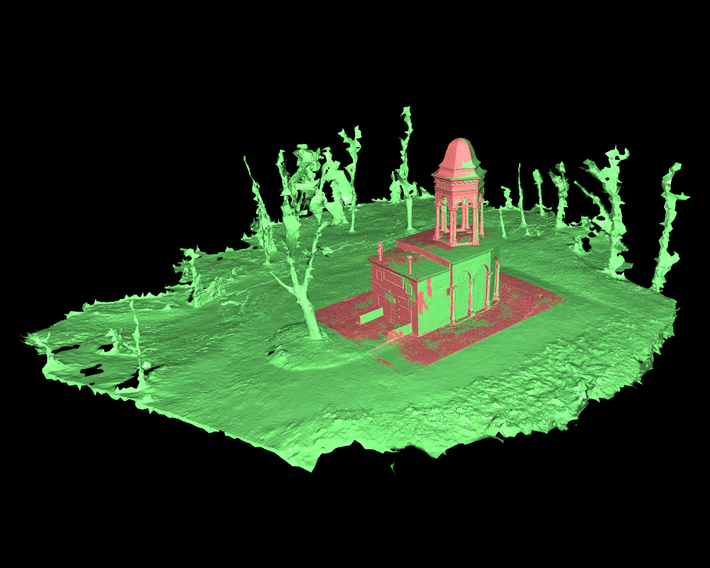
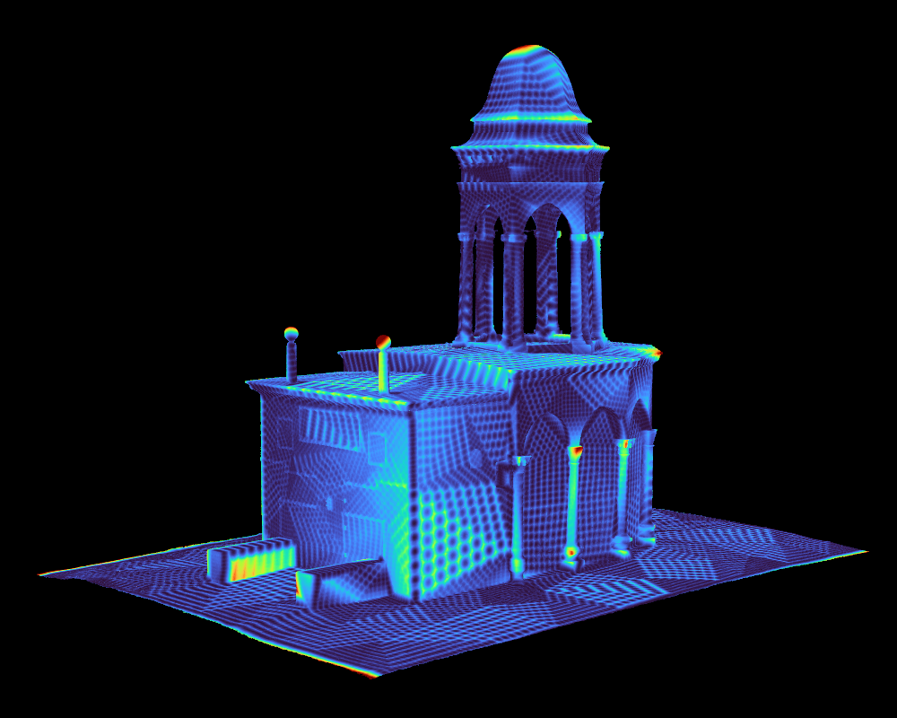

# 3DV Tools
Scripts and tools I use daily for 3D computer vision research. Every script should be self-contained (not importing any local files) and using a limited number of external packages.

## Scripts
Following is a list of the scripts in this repository, roughly ordered by their functionality:

- [blur_eval.py](scripts/blur_eval.py) - Compute a blur metric (avg. of local std. dev.) for given images.
- [img_img_psnr.py](scripts/img_img_psnr.py) - Compute PSNR between two images.
- [img_adj_gamma.py](scripts/img_adj_gamma.py) - Apply gamma correction on given a image.
- [img_eqhist.py](scripts/img_eqhist.py) - Apply global histogram equalization or CLAHE on a given image.
- [img_filt_bilat.py](scripts/img_filt_bilat.py) - Apply bilateral filter on a given image.
- [img_filt_gauss.py](scripts/img_filt_gauss.py) - Apply Gaussian filter on a given image.
- [img_filt_med.py](scripts/img_filt_med.py) - Apply median filter on a given image.
- [img_apply_lut.py](scripts/img_apply_lut.py) - Apply a LUT (defined in a file) to a given image.
- [color_view.py](scripts/color_view.py) - Visualize a color in terminal based on RGB or HEX values.
- [matplotlib_colormap.py](scripts/matplotlib_colormap.py) - Get color samples from a Matplotlib colormap.
- [cam_poses_environment.py](scripts/cam_poses_environment.py) - Sample camera poses for rendering of an outdoor or indoor environment 3D mesh model.
- [cam_poses_object_centric.py](scripts/cam_poses_object_centric.py) - Sample camera poses for rendering of an object-centric 3D mesh model.
- [depth_mode_change.py](scripts/depth_mode_change.py) - Change the mode of a given depth map between distance from camera center and Z-distance from camera plane.
- [depth_to_pc_in_colmap_frame.py](scripts/depth_to_pc_in_colmap_frame.py) - Convert depth map to point cloud, using the camera intrinsics and extrinsics from a given COLMAP model.
- [noise_depth_maps.py](scripts/noise_depth_maps.py) - Add Gaussian noise (additive or multiplicative) to a given depth map.
- [gpx_track2geojson_points.py](scripts/gpx_track2geojson_points.py) - Convert a track in GPX file to time-labelled point set in GeoJSON format.
- [img_gnss2geojson.py](scripts/img_gnss2geojson.py) - Export GNSS data from EXIF to GeoJSON format.
- [img_has_gnss.py](scripts/img_has_gnss.py) - Check if given images have GNSS data in their EXIF.
- [dji_srt_tools.py](scripts/dji_srt_tools.py) - Parse DJI SRT file (containing flight log data) and sample frames from a corresponding video. Export the spatio-temporal data in EXIF of the video frames and in GPX or GeoJSON format.
- [mask_change_format.py](scripts/mask_change_format.py) - Change format of a given binary mask between formates accepted by I-NGP and Nerfstudio.
- [mask_invert.py](scripts/mask_invert.py) - Invert the given binary mask.
- [mask_to_alpha.py](scripts/mask_to_alpha.py) - Move a given binary mask to the alpha channel of a given image.
- [mask_visualize.py](scripts/vis_masks.py) - Blend a binary with a corresponding image.
- [mesh_dist.py](scripts/mesh_dist.py) - Visualize distances between two mesh models and report distance statistics.
- [vis_cam_poses.py](scripts/vis_cam_poses.py) - Visualize camera poses in 3D space. 
- [vis_depth.py](scripts/vis_depth.py) - Visualize and export a given depth map as a colored image or a 3D point cloud.
- [compare_meshes.py](scripts/compare_meshes.py) - Visualize multiple 3D mesh models for easy visual comparison.
- [model_centroid.py](scripts/model_centroid.py) - Compute the location of center and parameters of bounding box of a given 3D mesh model.
- [subsample_pc_meshlab.py](scripts/subsample_pc_meshlab.py) - Subsample a given point cloud using Meshlab API.
- [geotiff2ply.py](scripts/geotiff2ply.py) - Convert a surface height map in TIFF format to a 3D mesh in PLY format.
- [renderer_o3d.py](scripts/renderer_o3d.py) - Render a 3D mesh model from given camera poses using Open3D.
- [colmap/bundler2colmap.py](scripts/colmap/bundler2colmap.py) - Convert a [Bundler](https://www.cs.cornell.edu/~snavely/bundler/) sparse SfM model to COLMAP format.
- [colmap/nvm2colmap.py](scripts/colmap/nvm2colmap.py) - Convert a [VisualSFM](http://ccwu.me/vsfm/) NVM sparse SfM model to COLMAP format.
- [colmap/colmap_basenames.py](scripts/colmap/colmap_basenames.py) - Rename images in a given COLMAP model to their basenames.
- [colmap/colmap_flatten_dirs.py](scripts/colmap/colmap_flatten_dirs.py) - Flatten the directory structure of a given COLMAP model and images, moving the relative paths to the names of the images.
- [colmap/colmap_undist.py](scripts/colmap/colmap_undist.py) - Undistort a given COLMAP model and images.
- [colmap/colmap_resize.py](scripts/colmap/colmap_resize.py) - Change the size of the cameras in a given COLMAP model.
- [colmap/colmap_change_cam_model.py](scripts/colmap/colmap_change_cam_model.py) - Change the camera model of all cameras in a given COLMAP model.
- [colmap/colmap_merge_similar_cameras.py](scripts/colmap/colmap_merge_similar_cameras.py) - Merge cameras in a given COLMAP model that are similar to each other.
- [colmap/colmap_mult2single_cam.py](scripts/colmap/colmap_mult2single_cam.py) - Replace multiple camera models in a given COLMAP model with a single one using the average of the original parameters.
- [colmap/colmap_align_cam_sets.py](scripts/colmap/colmap_align_cam_sets.py) - Take two sparse COLMAP models whose cameras are transformed by a common transformation relative to each other and align them to a common coordinate frame.
- [colmap/colmap_covis_divide_scene.py](scripts/colmap/colmap_covis_divide_scene.py) - Divide a given COLMAP model into submodels based on the covisibility between the cameras.
- [colmap/colmap_find_covis_cams.py](scripts/colmap/colmap_find_covis_cams.py) - Return a subset of a given COLMAP model that contains only the cameras that are covisible with the given camera.
- [colmap/colmap_subset.py](scripts/colmap/colmap_subset.py) - Create a subset of a given COLMAP model based on a list of image names or an image directory.
- [colmap/imgs_subset_by_colmap.py](scripts/colmap/imgs_subset_by_colmap.py) - Create a subset of a given image directory based on the images in a COLMAP model.
- [colmap/colmap_merge_models.py](scripts/colmap/colmap_merge_models.py) - Merge multiple COLMAP models into a single model.
- [colmap/colmap_vis_rerun.py](scripts/colmap/colmap_vis_rerun.py) - Visualize a COLMAP model and optionally also a mesh model using Rerun SDK.

**Example visualizations produced by the scripts:**
|  |  |
|-------------------------|-------------------------|
| cam_poses_environment.py | cam_poses_object_centric.py |
|  |  |
| vis_cam_poses.py | compare_meshes.py |
|  |  |
| vis_depth.py depth map | vis_depth.py point cloud |
|  |  |
| mesh_dist.py | - |
|  | - |
